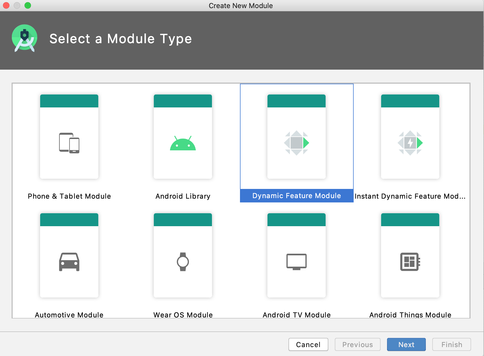
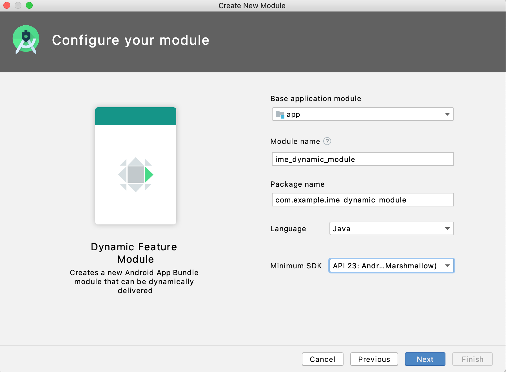
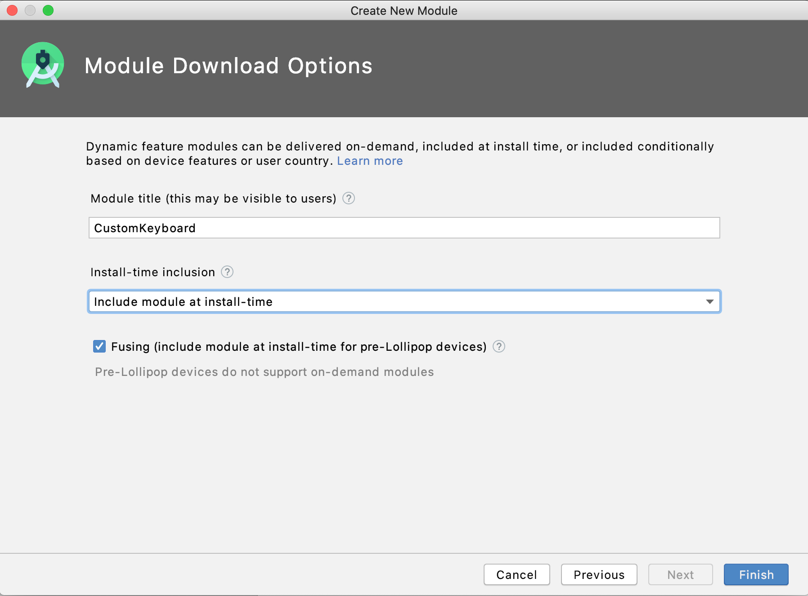
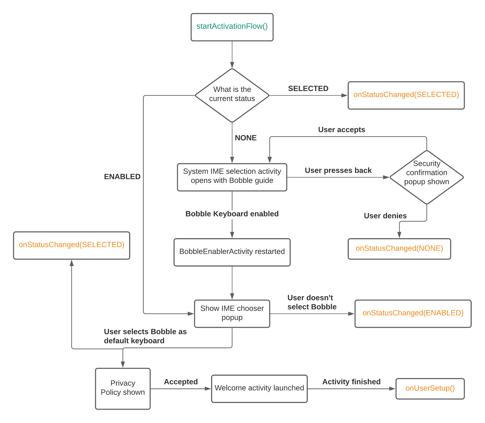

# Bobble IME SDK via Dynamic module

Dynamic delivery is a delivery mechanism by Google Play Store where specific modules of your app can be downloaded on a user's device after the core module has been downloaded. This gives developers, the freedom to opt for a smaller download size. This is done by ensuring that the additional features, like this custom keyboard, are delivered to users upon their choice. We provide support for such implementation by dividing our SDK into 2 parts 

- Full size SDK which can be added to a dynamic module and 
- An ultra-lightweight support SDK (to be added to main module) to provide necessary support implementations. 

## Table of Contents
1. [Limitations](#limitations)
1. [Working](#working)
1. [Integration](#integration)
1. [Adding a dynamic module to your Project](#step1)
1. [Gradle setup](#step2)
2. [Adding permissions](#step3)
3. [Manifest changes](#step4)
4. [Other build settings](#step5)
4. [Install SplitCompat to support dynamic modules](#step6)
5. [Initialise SDK](#step7)
6. [Create your custom IME Class](#step8)
7. [Refactor existing WebViews](#step9)
8. [Initiate keyboard enable and selection](#step10)
9. [Other APIs](#api)

## <a name="limitations"></a>Limitations
Consider following limitations of Dynamic delivery, which you must evaluate before opting for them.
1. You must distribute your app only via Play Store using the App Bundle (.aab) publishing format. The dynamic feature will not work with regular APKs.
2. User's who don't have Google Play Services, might not be able to avail dynamic features.

For more information on app-bundles and dynamic delivery, it is recommended to go through Android's official documentation.

https://developer.android.com/guide/app-bundle

https://developer.android.com/guide/app-bundle/dynamic-delivery

## <a name="working"></a>Working
When the user first downloads the client app, only the support library will be shipped. The client can download the module either automatically or on-demand via user initiated action. You are free to implement your own logic of install/uninstall as per your need.

Once the keyboard modules are succesfully downloaded, the keyboard starts functioning as expected.

## <a name="integration"></a>Integration

### <a name="step1"></a>Step 1: Adding a dynamic module to your Project
Within Android Studio, navigate to **File -> New -> New Module** and follow on screen instructions as follows
Setup 1             |  Setup 2             |  Setup 3
:-------------------------:|:-------------------------:|:-------------------------:
  |    |   

### <a name="step2"></a>Step 2: Gradle setup
Pull the latest version of the SDK from mavenCentral() as described below:

- Include Maven in your top-level build.gradle file along with the credentials(Read URL and Read password):

```groovy
allprojects {
    repositories {
        maven {
            url "http://dl.appnext.com/"
        }
        maven {
            url <getReadUrl>
            credentials {
                username 'myMavenRepo'
                password <getPassword>
            }
        }
    }
}
```

- Add the following line to the dependencies element in your **base application module’s** build.gradle.

```groovy
implementation 'com.touchtalent.bobblekeyboard-dynamic-support:1.0.0'
```
- Add the following line to the dependencies element in your **dynamic module’s** build.gradle.

```groovy
implementation 'com.touchtalent.bobblekeyboard-dynamic:1.0.0'
```

- Sync your Gradle project to ensure that the dependency is downloaded by the build system.


### <a name="step3"></a>Step 3: Adding Permissions

The SDK uses the permissions granted to your app in order to improve the typing experience, and in order to suggest the most relevant content to your users.
We highly recommend that your app request the following permissions so that we can personalise user experience in a better way:
```xml
<uses-permission android:name="android.permission.ACCESS_FINE_LOCATION" />
<uses-permission android:name="android.permission.CAMERA" />
<uses-permission android:name="android.permission.RECORD_AUDIO" />
<uses-permission android:name="android.permission.READ_CONTACTS" />
```
    
    
### <a name="step4"></a>Step 4: Manifest Changes
The client needs to register the custom IME class in manifest as InputMethod service.

```xml
<service
    android:name=".CustomIME"
    android:label="<Your keyboard name here>"
    android:permission="android.permission.BIND_INPUT_METHOD">
    <intent-filter>
        <action android:name="android.view.InputMethod" />
    </intent-filter>
    <meta-data 
    	android:name="android.view.im"
       	android:resource="@xml/bobble_ime" />
</service>
```

### <a name="step5"></a>Step 5: Other Build Settings
- Add option to not compress dictionary files by following lines in the android block of your dynamic module's gradle
```groovy
aaptOptions {
    noCompress ".dict"
}
```

### <a name="step6"></a>Step 6: Install SplitCompat to support dynamic modules

Inside onAttachBaseContext() method of your Application class, install SplitCompat in your app
```java
public class MyApplication extends Application{

    @Override
    public void onAttachBaseContext(){
        SplitCompat.install(context); 
    }
}
```

### <a name="step7"></a>Step 7: Initialise SDK

Inside onCreate() method of your Application class, initialise the SDK by calling
```java
public class MyApplication extends Application{

    @Override
    public void onAttachBaseContext(){
        BobbleIMESDK.initialise(applicationContext, <module-name>); 
    }
} 
```

**\<module-name>** is the name of module that you provide in step 1(**ime_dynamic_module** as per the example).

### <a name="step8"></a>Step 8: Create your custom IME Class
Last step would be to create the custom class declared in the manifest above.
```java
import com.bobblekeyboard.ime.BobbleIME;

class CustomIME extends BobbleIME {
    @Override
    public void onCreate() {
        super.onCreate();
    }
}
```
### <a name="step9"></a>Step 9: Refactor WebViews used within main process.
Implementing a WebView and an IME in the same process introduces a system level bug - Input boxes within the WebView cause Crashes/ANR when focused on. 

This system bug should be avoided by any of the 2 methods mentioned below -  

#### Method 1 - 

Refactor all usages of `WebView` wihtin the application to `BobbleWebView` (com.touchtalent.bobbleime.sdk.BobbleWebView). `BobbleWebView` is a extension class of `WebView` which can used within XML layouts or Java/Kotlin classes similar to `WebView`. E.g - 
```xml
<com.touchtalent.bobbleime.sdk.BobbleWebView
    android:id="@+id/webView"
    android:layout_width="match_parent"
    android:layout_height="match_parent">
</com.touchtalent.bobbleime.sdk.BobbleWebView>

                    OR

WebView webView = new BobbleWebView(context);
```
<div align="center"> <b>OR</b> </div>

#### Method 2 - 

Create your own custom class extending `WebView`/ modify exisiting extension class of `WebView` by overriding `onCreateInputConnection(EditorInfo)` as described below.
```java
public class CustomWebView extends WebView {

    @Override
    public InputConnection onCreateInputConnection(EditorInfo outAttrs) {
        outAttrs.privateImeOptions = "BobbleBuggyEditText";
        return super.onCreateInputConnection(outAttrs);
    }
}
```
P.S - Adopting one of the above methods is mandatory for smooth functioning of the keyboard within WebViews of your application. Invoking keyboard inside plain WebView will result in Crashes/ANR.

### <a name="step10"></a>Step 10: Initiate keyboard enable and selection
Upon successful installation of the IME module, initiate the keyboard enabling flow. Create a new activity by extending ```BobbleEnablerActivity``` which would act as a entry point for the complete enabling flow. Use following functions and callbacks to start/track progress.

1. ```getStatus()``` - To know the current status and prepare the UI accordingly.
2. ```startActivationFlow()``` - Calling this will evaluate the current status and initiate the enabling flow accordingly.
3. ```onStatusChange(BobbleIMESDK.IMEInstallStatus status)``` - This callback is received when the enabling flow is complete. ```status``` is one of the following : 
 - SELECTED : User enabled and selected the keyboard as well.
 - ENABLED : User just enabled the keyboard but did not select it as the default one.
 - NONE : User did not do anything and returned from the settings pages. This can be used to initiate any client side flow for educating users on how to enable it.
 4. ```onUserSetup()``` - The user has succesfully been onboarded. At this point, consider redirecting user to the home page of your application.

The following flowchart shows the enabling process and the state in which each callback is fired:

<p align="center">
  
</p>

 P.S - The activity extending ```BobbleEnablerActivity``` may restart during the enabling flow because of system limitations. Care has to be taken to maintain activity state. If user presses back on this screen, it is possible that the system's IME chooser activity opens instead of the parent activity. To prevent this and maintain the navigation consider adding this in your activity :

 ```java
  @Override
    public void onBackPressed() {
        finish();
        Intent intent = new Intent(this, <parent_activity>.class);
        intent.addFlags(Intent.FLAG_ACTIVITY_REORDER_TO_FRONT);
        startActivity(intent);
    }
```

### <a name="api"></a>APIs


#### Check if module is installed or not
```java
boolean isModuleDownloaded = BobbleIMESDK.isDownloaded();
```

#### Initiate installation of module
```java
BobbleIMESDK.install(context, new InstallCompleteListener(){
	
	@Override
	public void onSuccess(){
	
	}
	
	@Override
	public  void onFailure(){
	
	}
});
```

#### Uninstall the module to free up space
```java
BobbleIMESDK.uninstall(context);
```


#### Check if keyboard is enabled
```java
boolean BobbleIMESDK.isKeyboardEnabled()
```
This API can be used to check if the keyboard is enabled inside the global input method settings.

#### Check if keyboard is selected
```java
boolean BobbleIMESDK.isKeyboardSelected()
```
This API can be used to check if the keyboard is the current selected input method editor in the system.
